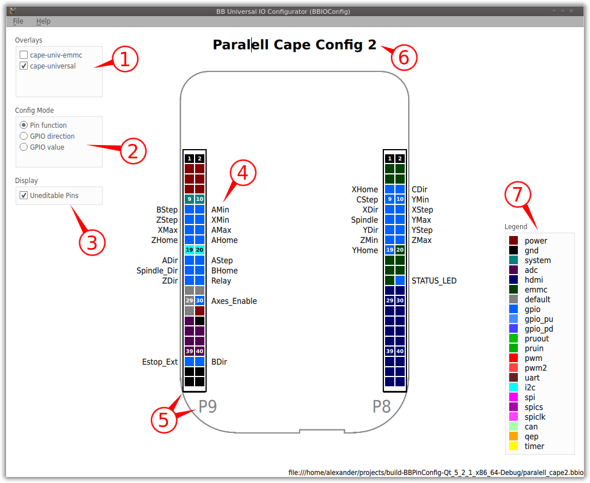

# BBIOConfig

A GUI for the BB universal IO
https://github.com/cdsteinkuehler/beaglebone-universal-io

## Using BBIOConfig
To use BBIOConfig you will need a very recent Debian BB image with the config-pin utility installed. In case you don't have such an image installed on you Beagle Bone please download install the BB universal IO from here: https://github.com/cdsteinkuehler/beaglebone-universal-io

To find out whether you have the BB universal IO installed on your BeagleBone connect via SSH and try to run config-pin. If you have the BB universal IO installed you will see some application output.

### UI Overview

The UI has the following elements:
1. Device tree overlay selection menu
2. Config mode selection menu
3. Display selection menu
4. Pin description
5. Port with port name
6. Configuration title
7. Color and pin function legend

### Creating a IO configuration
To create a new pin configuration start by create a new document using the application menu **Ctrl+N** or **File>New**. Then save the new file using **Ctrl+S** or **File>Save**. Now you can start creating you IO configuration. Make sure that you save you document regularly since BBIOConfig currently does not check for changes and warn when closed.

Start by selecting a device tree overlay (1). I recommend using only the cape-universal for a start as it does not conflict with eMMC and HDMI pins. To see more clearly which pins can be edited or not you can modify the check in the display config menu (3). When you hover the colored pins in the legend (7) you can see which pins can be configured to which function. When you click on a pin at a port (5) you will get configuration menu showing you all the function that can be selected for one pin.

If you select **gpio, gpio_pd or gpio_pu** as pin function you can further modify the pin direction and default value by changing the config mode (2).

For every editable pin you can also add description by clicking the edits next to the pins (4).
**NOTE:** You can use the keyboard (Tab and arrow keys) to navigate between the description fields. Also try out using the Return key to navigate to corresponding pin (press space to open the menu or the arrow keys to change the function).

You can also change the title displayed on top the of the configuration window by clicking on it (6).

### Using a IO configuration
To use a IO configuration created with BBIOConfig deploy it to your BeagleBone you must use the config-pin utility:
`config-pin -f <filename>.bbio`
